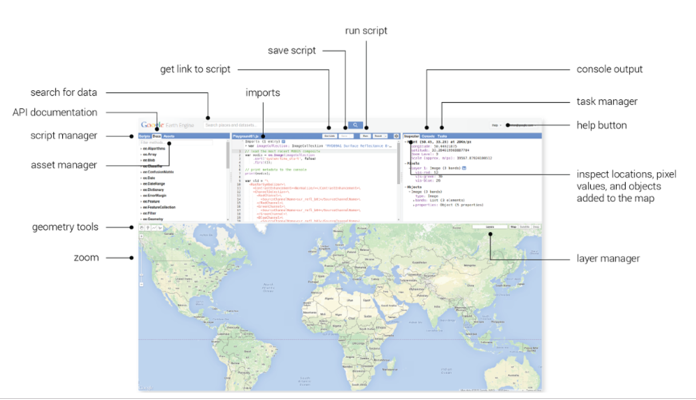
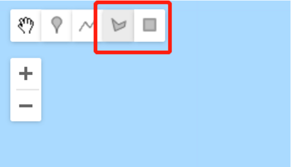
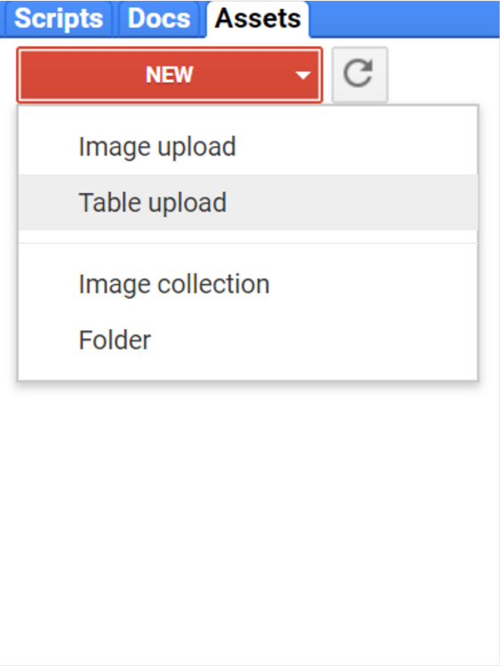

## 介绍
> GEE(Google Earth Engine)是一界面友好、接口丰富的空间大数据在线分析平台。集成了从卫星影像、地理空间数据到数据提取、分析等算法集合，以及成果导出等工具。
使用shadowsocks等梯子之后，进入GEE[网站](https://earthengine.google.com/)后，有三种方式和平台进行交互：

1. `Code Editor`: 一个前端版的集成开发环境(IDE)，用于编写和运行代码。界面环境如图1所示：

> 图片来源：https://earthengine.google.com/platform/
2. `Explorer`: 一个简单的GEE API网络接口，用于公共数据集的可视化，登陆后也可以导入数据。运行简单的分析算法、保存和导出结果。
此外，还有`client libraries`, 提供了JavaScript和Python的API接口。可以方便地再`Code Editor`中处理和分析数据。

## Sentinel-2 NDVI计算
利用GEE计算多年NDVI十分简单，只需要以下三步：
- [x]  选定研究区
- [x]  选择数据源、确定时间范围
- [x]  计算NDVI

#### 选定研究区
确定矢量roi有两种方式，手动勾画研究区或上传矢量文件：
1. 手动勾画方式，见下图：



2. 上传矢量：




#### 选择数据源
``` 
 var ds = ee.ImageCollection("COPERNICUS/S2").filterDate(start, end)
```
* 其中，`start`和`end`分别代表起止时间的字符串，如`2018-01-01`

根据感兴趣区进行筛选：
```
ee.imageCollection.filterBounds(geometry) 
```

#### 计算NDVI
Sentinel-2的NDVI计算公式：
```math
NDVI = \left(\frac{B8-B4}{B8+B4}\right)
```
计算NDVI：
```
.map(function(image) { 
    return image.addBands(image.normalizedDifference(["B8", "B4"])
    .rename("NDVI"));}) 
```

## Sentinel-2云判
```
function maskS2clouds(image) {
  var qa = image.select('QA60');

  // Bits 10 and 11 are clouds and cirrus, respectively.
  var cloudBitMask = 1 << 10;
  var cirrusBitMask = 1 << 11;

  // Both flags should be set to zero, indicating clear conditions.
  var mask = qa.bitwiseAnd(cloudBitMask).eq(0)
      .and(qa.bitwiseAnd(cirrusBitMask).eq(0));

  return image.updateMask(mask).divide(10000);
}
```

## 附 完整代码：
```
function maskS2clouds(image) {
  var qa = image.select('QA60');

  // Bits 10 and 11 are clouds and cirrus, respectively.
  var cloudBitMask = 1 << 10;
  var cirrusBitMask = 1 << 11;

  // Both flags should be set to zero, indicating clear conditions.
  var mask = qa.bitwiseAnd(cloudBitMask).eq(0)
      .and(qa.bitwiseAnd(cirrusBitMask).eq(0));

  return image.updateMask(mask).divide(10000);
}

function extractData(start, end) {
      var ds = ee.ImageCollection("COPERNICUS/S2")
        .filterDate(start, end)
        .filterBounds(geometry) 
        //.filter(ee.Filter.lt('CLOUDY_PIXEL_PERCENTAGE', 20))
        //.map(maskS2clouds)
        .map(function(image) { 
             return image.addBands(image.normalizedDifference(["B8", "B4"]).rename("NDVI"));              }) 
        .select("NDVI")
         .reduce(ee.Reducer.max())
        .aside(print);
```